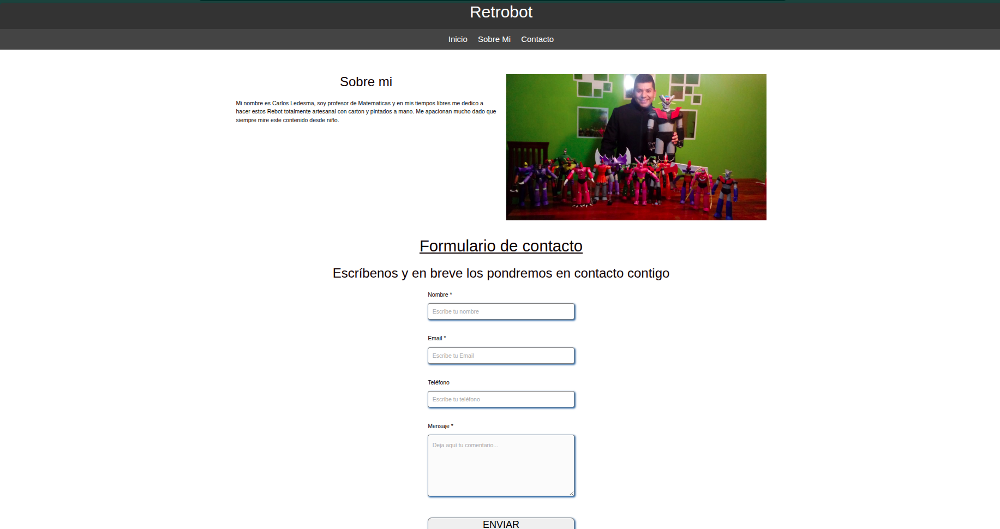

# 🤖 Proyecto Retrobot

Proyecto final desarrollado para el programa **BA Multiplica**.

La aplicación consiste en una página web interactiva desarrollada con **HTML, CSS y JavaScript**, con temática retro/robot.

---

## 🌐 Demo

👉 https://megon1.github.io/Proyecto-Retrobot/

---

## 📌 Descripción

Retrobot es una página web creada como proyecto final del curso BA Multiplica.

El objetivo fue aplicar conocimientos básicos de desarrollo web utilizando:

- HTML para la estructura
- CSS para el diseño
- JavaScript para la lógica e interacción

---

## 🛠 Tecnologías utilizadas

- HTML5
- CSS3
- JavaScript

---

## 📂 Estructura del proyecto

```
Proyecto-Retrobot
│
├── index.html
├── edad.html
├── estilos.css
├── script.js
├── arreglos.js
├── 1.jpeg
└── bosquejo de web.jpg
```

---


## 🎯 Objetivo del proyecto

Practicar el desarrollo de páginas web combinando estructura, diseño y lógica de programación utilizando tecnologías front-end básicas.

---

## 👨‍💻 Autor

**Mauro Gonzalez**

QA Analyst en formación interesado en testing manual y automatización.

GitHub: https://github.com/megon1
